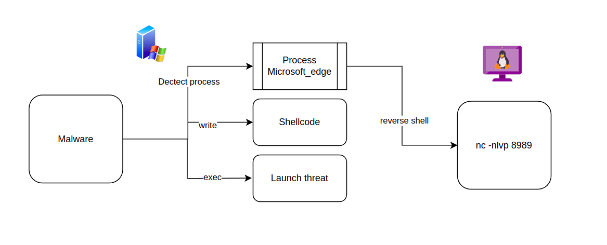
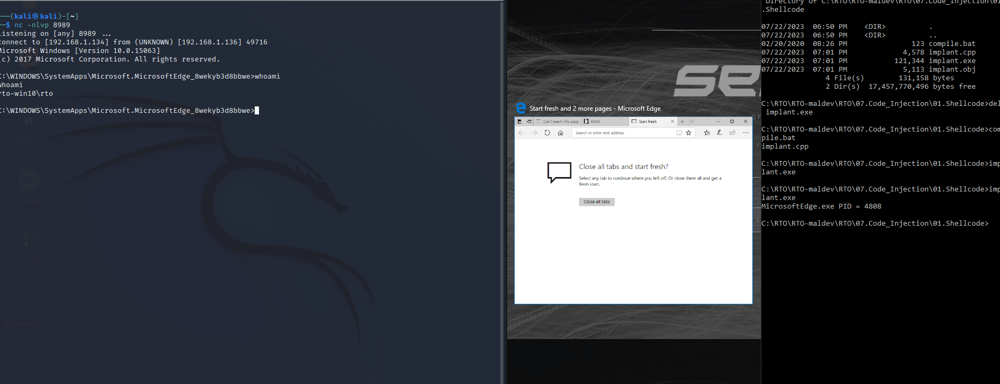

# ShellCode Process Injection

## Index of content:
  1. [Source_code](Shellcode_process_injection.cpp)
  2. [Compile](compile_shellcode_process_injection.bat)
  3. [Evidences](#evidences)

## Evidences:

